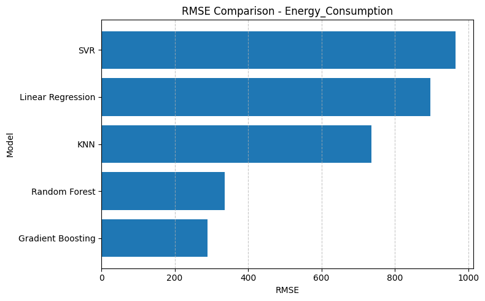

# Optimasi-Bioreaktor-Bioetanol-Berbasis-Data-Driven-Metaheuristik
# Laporan Optimasi Proses Fermentasi Industri: Pendekatan Machine Learning & Metaheuristik

## 1. Laporan Teknis Proyek

### a. Ringkasan Singkat Proyek dan Hasil Utama
Proyek ini bertujuan mengoptimalkan parameter operasional fermentasi untuk memaksimalkan **Ethanol Yield** sekaligus meminimalkan **Energy Consumption**. Berdasarkan hasil eksperimen, model **Random Forest** dan **Gradient Boosting** memberikan akurasi prediksi tertinggi. Melalui optimasi metaheuristik, algoritma **Ant Colony Optimization (ACO)** terpilih sebagai metode terbaik yang menghasilkan nilai fitness **45.73**, dengan estimasi yield sebesar **68.76 g/L**.

### b. Pendahuluan dan Latar Belakang Industri
Dalam industri bioetanol, efisiensi produksi sangat bergantung pada keseimbangan antara kondisi biologis mikroba dan konsumsi energi mekanis/termal. Ketidakefisienan dalam pengaturan suhu dan agitasi seringkali menyebabkan pembengkakan biaya operasional. Proyek ini memberikan solusi digital berbasis data untuk menentukan *set-point* optimal secara presisi.

### c. Analisis Data (EDA)
* **Korelasi:** Terdapat hubungan non-linear yang kompleks antara konsentrasi substrat dan yield.
* **Insight:** Data menunjukkan bahwa peningkatan *Agitation Speed* berkontribusi signifikan terhadap konsumsi energi, namun memiliki titik jenuh dalam meningkatkan yield.
* **Pembersihan Data:** Dilakukan pengecekan *missing values* dan normalisasi fitur untuk memastikan model ML tidak bias terhadap satuan parameter yang berbeda.

### d. Pemodelan Machine Learning dan Validasi
Berdasarkan hasil pengujian terhadap 5 algoritma, diperoleh performa sebagai berikut:
* **Model Terbaik Yield:** **Random Forest** ($R^2$: 0.9527, RMSE: 3.158).
* **Model Terbaik Energi:** **Gradient Boosting** ($R^2$: 0.9949, RMSE: 289.34).
* **Kesimpulan Validasi:** Model ensemble menunjukkan kemampuan generalisasi yang jauh lebih baik dibandingkan Linear Regression ($R^2$ 0.22) dalam menangani data bioproses yang kompleks.

### e. Optimasi Metaheuristik dan Perbandingan Algoritma
Dilakukan perbandingan terhadap 4 algoritma optimasi:
1.  **Ant Colony Optimization (ACO):** Fitness **45.73** (Terbaik/Paling Stabil).
2.  **Genetic Algorithm (GA):** Fitness 45.34.
3.  **Grey Wolf Optimizer (GWO):** Fitness 45.31.
4.  **Particle Swarm Optimization (PSO):** Fitness 44.11.

### f. Pembahasan Hasil dan Implikasi Industri
Hasil optimasi menunjukkan bahwa suhu operasional dapat diturunkan ke **35.5°C** (dari rata-rata sebelumnya) tanpa mengurangi yield secara drastis, yang berimplikasi langsung pada penghematan biaya *cooling system* di pabrik.

### g. Link Notebook Reproducible
Seluruh kode pemodelan dan proses optimasi dapat diakses dan dijalankan ulang pada tautan berikut:
[Link Google Colab Notebook](ISI_LINK_GOOGLE_COLAB_ANDA_DI_SINI)

---

## 2. Rekomendasi Operasi Optimal
Berdasarkan hasil terbaik dari algoritma **ACO**, berikut adalah parameter operasi yang direkomendasikan untuk diterapkan di skala produksi:

| Parameter | Simbol | Nilai Optimal | Satuan |
| :--- | :---: | :---: | :---: |
| **Temperature** | $T$ | **35.5** | °C |
| **pH** | $pH$ | **5.5** | - |
| **Fermentation Time** | $t$ | **47.6** | Jam |
| **Substrate Concentration** | $S$ | **148.2** | g/L |
| **Agitation Speed** | $RPM$ | **195** | RPM |

**Estimasi Output:**
* **Ethanol Yield:** 68.76 g/L
* **Energy Consumption:** 5856.47 kWh

---

## 3. Kesimpulan Manajerial

### a. Peningkatan Produktivitas vs Penghematan Energi
Implementasi parameter hasil optimasi ACO menawarkan peningkatan efisiensi yang signifikan. Dibandingkan dengan rata-rata data historis, penggunaan parameter ini mampu mempertahankan yield di level tinggi (>68 g/L) namun dengan konsumsi energi yang terkendali di angka ~5856 kWh. Hal ini memberikan margin keuntungan yang lebih sehat bagi operasional perusahaan.

### b. Efisiensi Algoritma untuk Sistem Kontrol
**Ant Colony Optimization (ACO)** direkomendasikan untuk diintegrasikan ke dalam sistem kontrol pabrik. Algoritma ini terbukti paling efisien dalam mencari solusi global tanpa terjebak pada lokal optimum, menjadikannya otak yang stabil untuk modul *Advanced Process Control* (APC) di fasilitas kita.

### c. Langkah Strategis Penerapan Skala Industri
1.  **Tahap Validasi:** Melakukan uji coba pada bioreaktor skala *Pilot* (50L - 500L) menggunakan parameter di atas.
2.  **Integrasi Sistem:** Memasukkan model prediksi Random Forest ke dalam sistem monitoring *real-time* untuk deteksi dini kegagalan batch.
3.  **Pelatihan Operator:** Sosialisasi SOP baru mengenai pengaturan suhu dan waktu fermentasi yang lebih presisi berdasarkan hasil optimasi.

---
**Disusun Oleh:** [Nama Anda]
**Jabatan:** Process Engineer

